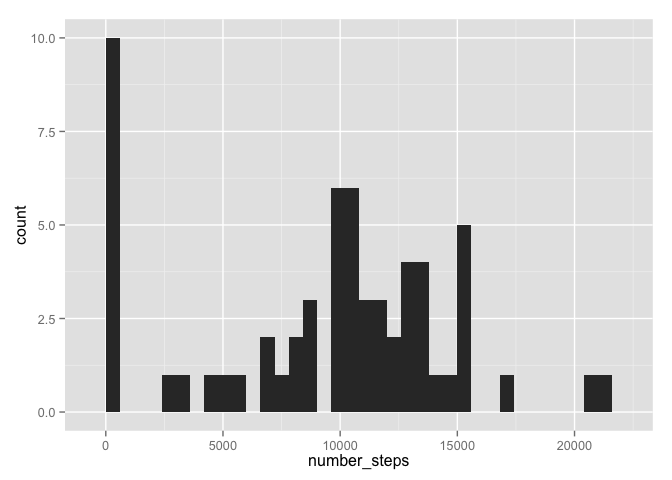

# Reproducible Research: Peer Assessment 1


## Loading and preprocessing the data

```r
tf <- unzip("./activity.zip")
activity_data <- read.csv(tf)
activity_data$date<-as.Date(activity_data$date)
```


## What is mean total number of steps taken per day?


```r
library(dplyr)
library(ggplot2)
total_steps_per_day <- activity_data %>% 
                        group_by(date) %>% 
                        summarise(number_steps = sum(steps, na.rm = TRUE))
qplot(number_steps, data = total_steps_per_day, geom="histogram", binwidth=600)
```

 


```r
mean_steps_per_day <- mean(total_steps_per_day$number_steps)
median_steps_per_day <- median(total_steps_per_day$number_steps)
```

The mean of steps taken per day is 9354.2295082. The median of steps 
taken perday is 10395.


## What is the average daily activity pattern?


## Imputing missing values


## Are there differences in activity patterns between weekdays and weekends?
