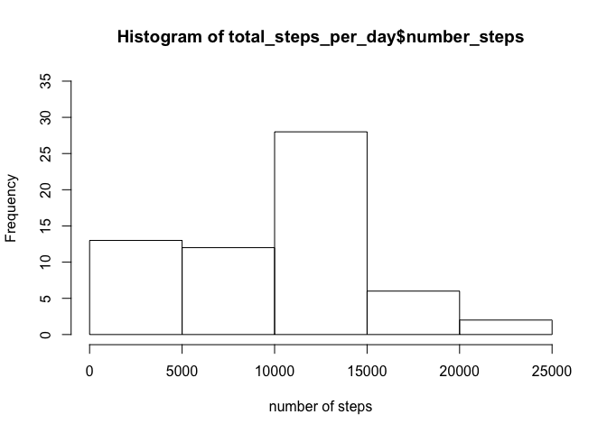

# Reproducible Research: Peer Assessment 1


## Loading and preprocessing the data

```r
tf <- unzip("./activity.zip")
activity_data <- read.csv(tf)
activity_data$date<-as.Date(activity_data$date)
```


## What is mean total number of steps taken per day?

```r
library(dplyr)
library(ggplot2)
total_steps_per_day <- activity_data %>% 
                        group_by(date) %>% 
                        summarise(number_steps = sum(steps, na.rm = TRUE))
qplot(number_steps, data = total_steps_per_day, geom="histogram", binwidth=5000)
```

 

```r
hist(total_steps_per_day$number_steps, xlab = "number of steps")
```

 


```r
mean_steps_per_day <- mean(total_steps_per_day$number_steps)
median_steps_per_day <- median(total_steps_per_day$number_steps)
```

The mean of steps taken per day is 9354.2295082. The median of steps 
taken perday is 10395.


## What is the average daily activity pattern?

```r
average_steps_by_interval <- activity_data %>% 
                                group_by(interval) %>%
                                summarise(average_steps_by_interval = 
                                            mean(steps, na.rm = TRUE))
g <- ggplot(average_steps_by_interval, 
            aes(x=interval, y=average_steps_by_interval))
g + geom_line()
```

 

```r
#which.max(average_steps_by_interval$average_steps_by_interval)
interval_max_average <- average_steps_by_interval$interval[which.max(
    average_steps_by_interval$average_steps_by_interval)]
```

The interval that contains the max average number of steps is 
835.

## Imputing missing values
# Calculate and report the total number of missing values in the dataset

```r
total_na <- sum(is.na(activity_data$steps))
```

The total number of missing values in the database is 2304. 


```r
#missing_intervals <- activity_data$interval[is.na(activity_data$steps)]
ind_missing_intervals <- which(is.na(activity_data$steps))
#activity_data$steps[activity_data %in% ]
#ind <- match(missing_intervals, average_steps_by_interval$interval)
#Replace the missing values with rounded step averages for matching interval on 
#other days
interpolated_steps <- replace(activity_data$steps, ind_missing_intervals, floor(average_steps_by_interval$average_steps_by_interval))

activity_data_interpolated <- data.frame(steps = interpolated_steps, 
                                         date = activity_data$date, 
                                         interval = activity_data$interval)
#Create histogram
total_steps_per_day_interpolated <- activity_data_interpolated %>% 
                        group_by(date) %>% 
                        summarise(number_steps = sum(steps, na.rm = TRUE))

hist(total_steps_per_day_interpolated$number_steps, xlab = "number of steps")
```

 


```r
mean_steps_per_day_interpolated <- mean(total_steps_per_day_interpolated$number_steps)
median_steps_per_day_interpolated <- median(total_steps_per_day_interpolated$number_steps)
```

The average steps taken per day after filling the missing values is 
9354.2295082, and the median of steps taken per day after filling the 
missing values 10395. The average steps increased by 
14.9188234% and 
the median by 
2.3665224% In 
terms of impact, the estimated steps created an extra 
8.5128\times 10^{4}
steps in the elapsed 61 days of data.

## Are there differences in activity patterns between weekdays and weekends?

```r
weekends <- weekdays(activity_data_interpolated$date) %in% 
    c("Saturday", "Sunday")
activity_data_interpolated$type_day <- factor(
    ifelse(weekends, "weekday", "weekend"))

library(lattice)
average_steps_by_interval <- activity_data_interpolated %>% 
                                     group_by(interval,type_day) %>%
                                     summarise(average_steps_by_interval = 
                                     mean(steps, na.rm = TRUE))

xyplot(average_steps_by_interval ~ interval | type_day, 
       data = average_steps_by_interval, layout = c(1, 2), type = "l", 
       ylab = "number of steps")
```

 
